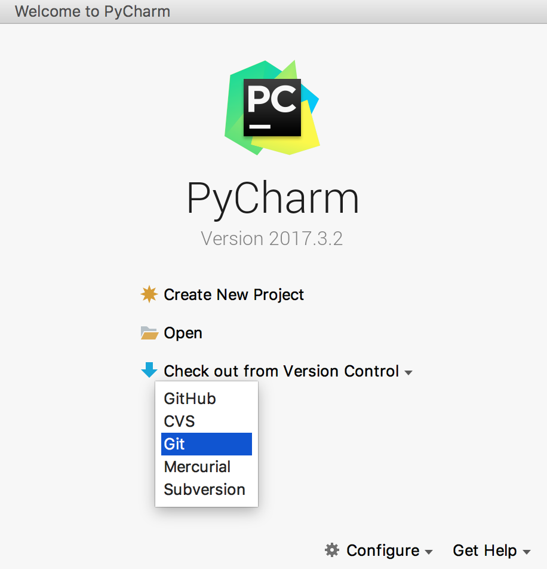
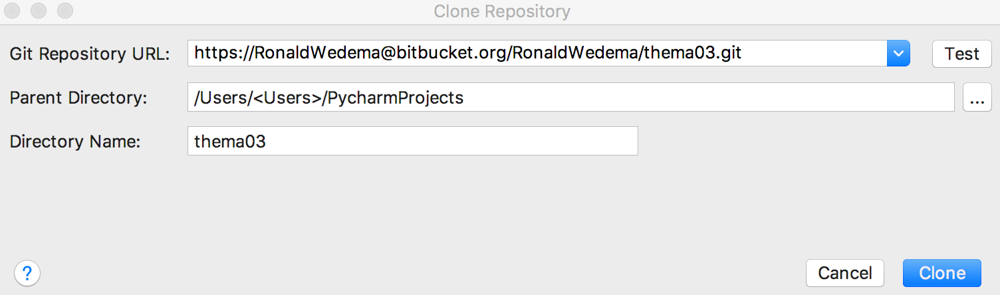
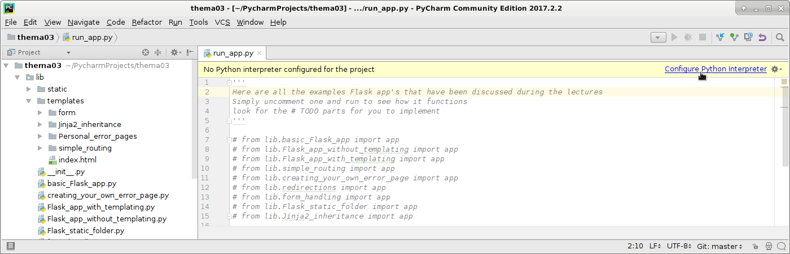
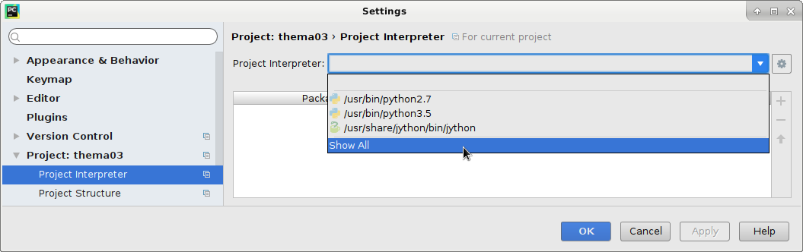
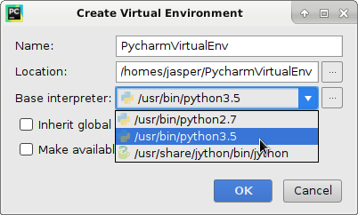
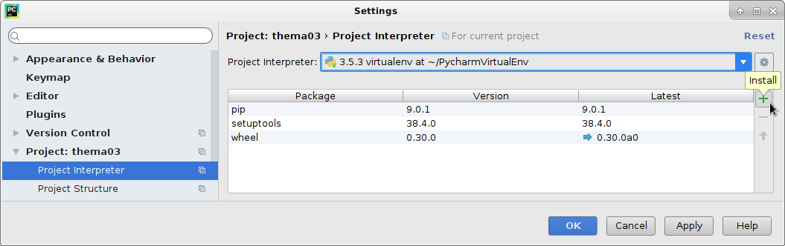
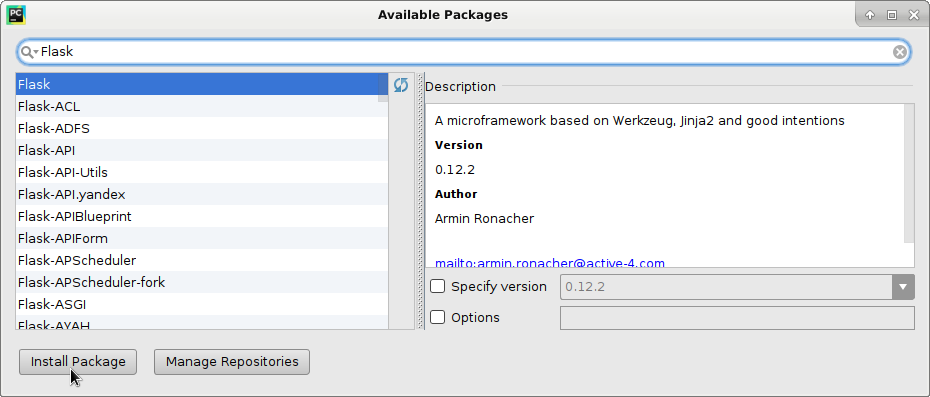

## Installation
This installation manual is for Pycharm and therefore the project should be run from the Pycharm program which is already available for the bioinformatics students of the Hanzehogeschool. Ofcourse, the repo could also be cloned using another IDE such as Visual Code, however then it is up to the student self to explore how this should be done.

Start Pycharm and in the **Welcome to Pycharm** screen select **Check out from Version Control** and select **Git**.

In the new window pass the url to the repository and press **clone**.

When asked to add files to Git select No.

Before we can run any examples/exercises we need to configure the Python interpreter to allow us to install packages into a virtual environment.
Open the run_app.py Python script and click on the configure Python interpreter in the top of the window. 

Next we need to configure the correction Python version. Select show all from the settings screen.

In the project Interpreters list click on the Plus sign on the right side and select *Create VirtualEnv*.
Here we can create a new virtual environment which allows us to install locally any missing Python dependencies. As Base interpreter select Python3.5 and give this environment a name in the Name field.

When the virtual environment has been installed we can add the Flask library to this environment. Click on the plus sign on the right hand side in the Project Interpreter Settings window.

Search for the Flask packages in the search box and click Install Package.

Once we have done this we now have a working Flask environment and can start playing with the examples/exercises. 
See the section [Examples](../README.md#markdown-header-exercises).